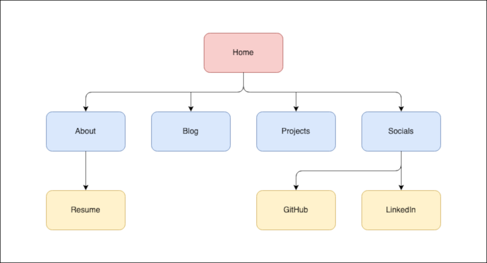
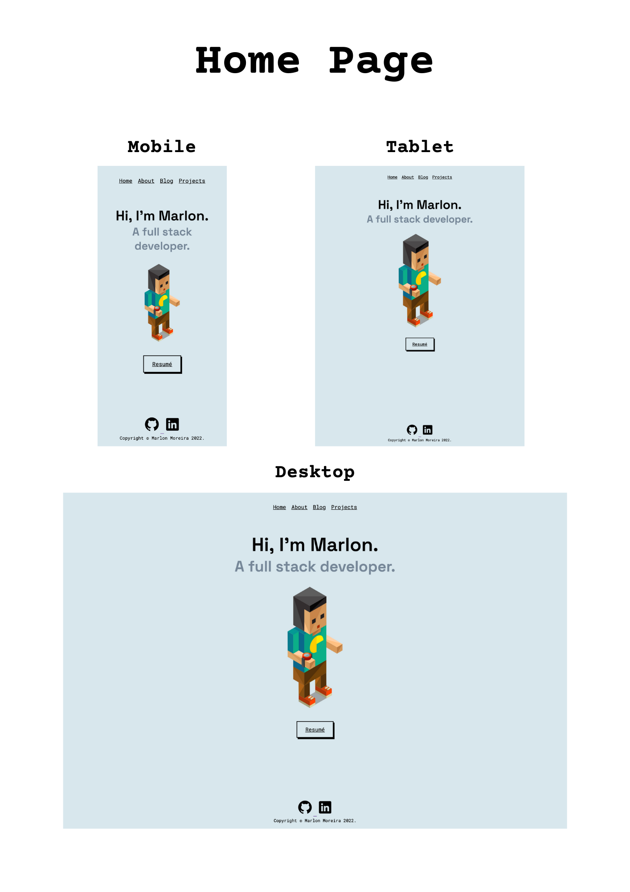
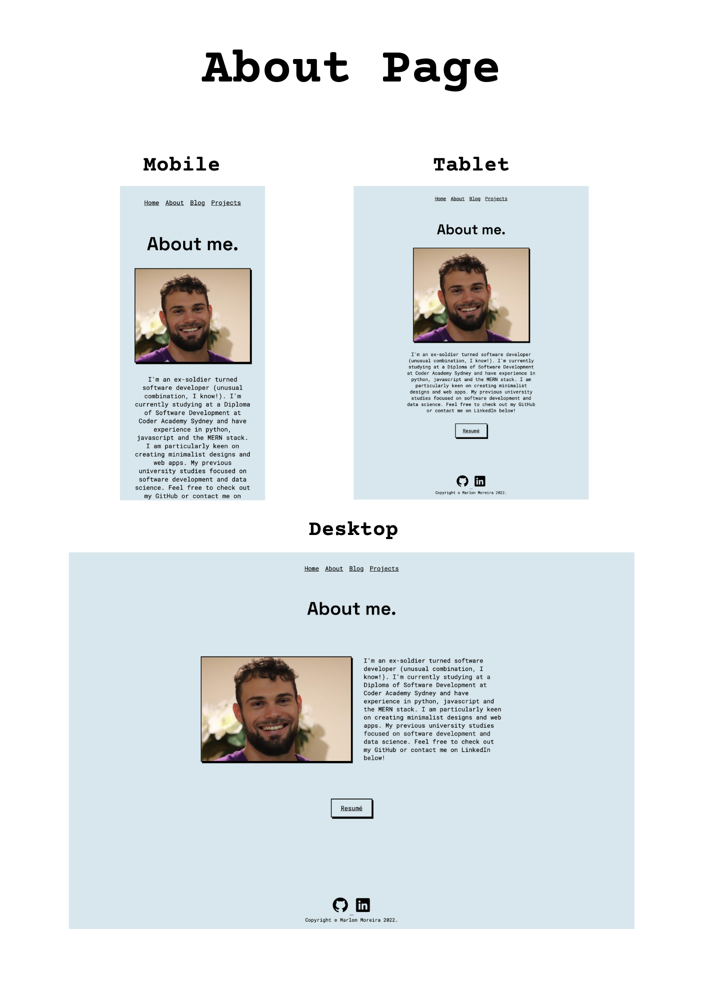
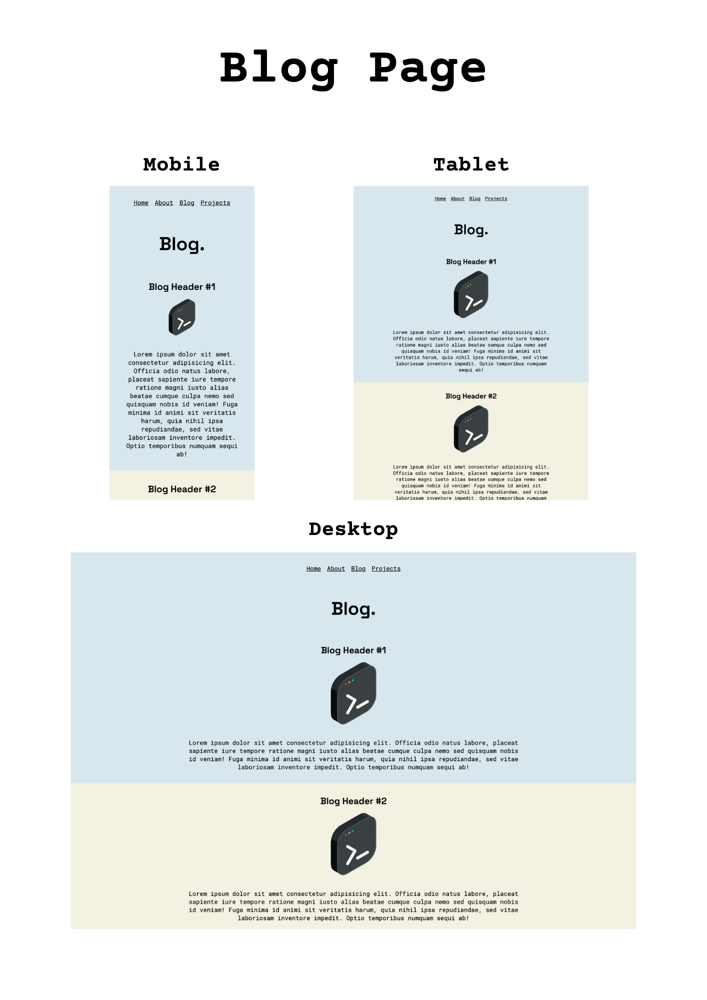
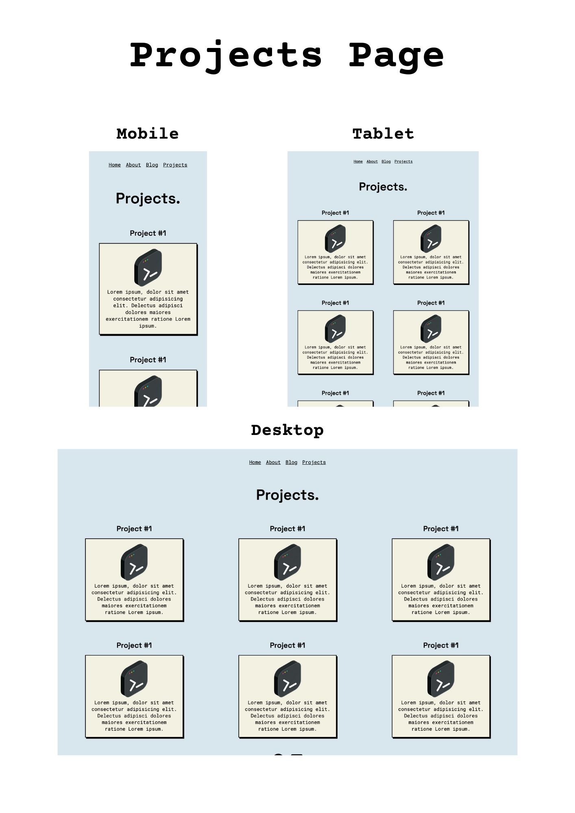

# Marlon Moreira - Portfolio Site

---

## Links

- [Demo video](https://www.linkedin.com/posts/marlonmoreira_my-first-portfolio-site-super-fun-to-make-activity-6915522190125785088-EDCG/?utm_source=linkedin_share&utm_medium=member_desktop_web)

- [Deployed site](https://marlonmoreira000.github.io/portfolio-site/)

- [Source code](https://github.com/marlonmoreira000/portfolio-site)

---

## Description

This is my first personal portfolio site, developed at Coder Academy. You can find all associated files and documents in this repository.

---

## Purpose

The purpose of this site is to demonstrate my coding skills and projects to potential employers.

---

## Functionality / Features

The main features for this site are:

- Fully responsive layout for all pages
- Significant use of Flexbox and media queries
- Use of semantic elements and comments make the code easy to follow.
- Code designed using the D.R.Y. principle.
- Animated titles on the landing page (using keyframes).
- Range of hover effects on links, buttons and images.
- Consistent use of colours and fonts to create coherency.
- Consistent use of design elements such as font and border styling.
- Reuseable components for navbars, buttons, cards and blog entries.
- Minimalistic design to create a sense of simplicity and aesthetics.

---

## Sitemap

---

## Screenshots

---

## Target Audience

The target audience is potential employers looking to hire software developers in Perth or remotely.

---

## Tech stack

For this project, I used the following technologies:

- Balsamiq (wireframes)
- Canva (screenshots and presentation)
- HTML5
- CSS3
- Git
- GitHub Pages
